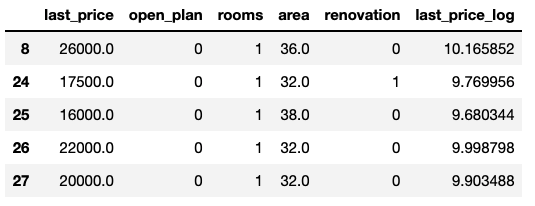

# test-project
###  Information about source data and some statistics (maybe plots, tables, images)

Dataset came from yander realty I guess.
Here is data sample.


### Information about your model, choosen framework, hyperparams)
Sklearn:
```
random_forest_model1 = RandomForestRegressor(n_estimators=1000,
                                    bootstrap=0.8,
                                    max_depth=10,
                                    min_samples_split=3,
                                    max_features=1)

random_forest_model2 = RandomForestRegressor(n_estimators=1000,
                                    bootstrap=0.8,
                                    max_depth=10,
                                    min_samples_split=3,
                                    max_features=1)
```

### How to install instructions and run your app with virtual environment 
```
virtualenv .env -p python3.7
source .env/bin/activate
pip install -r requirements.txt
python app.py
```

### Information about Dockerfile and describe it’s content
Contains arguments to run service in container (base - python3.7.9)

### How to open the port in your remote VM

```
sudo ufw allow 5000/tcp
```

### How to run app using docker and which port it uses

```
docker run --name test -p 5000:5000 -d service:latest
```